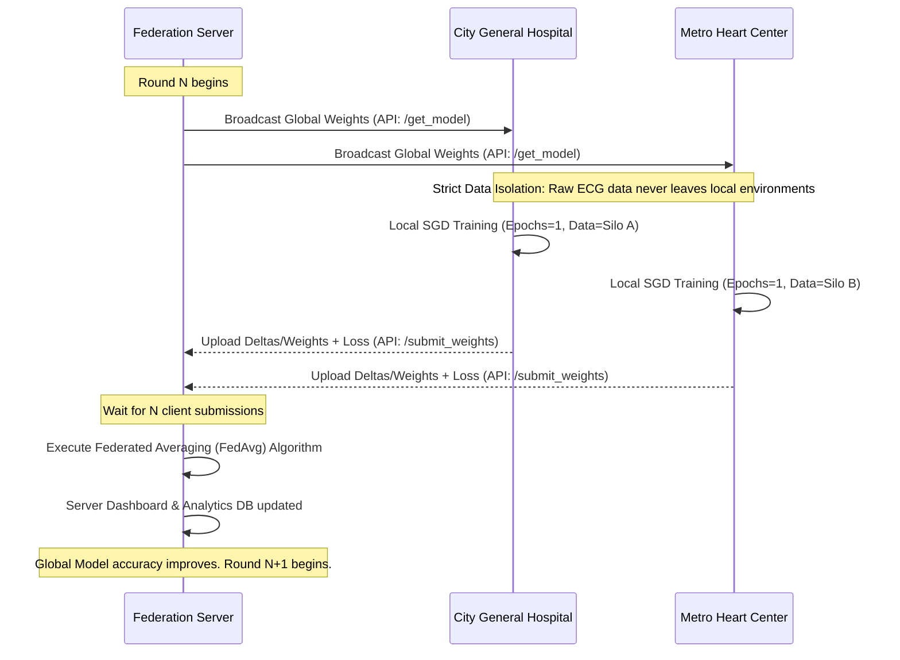

# 🫀 FedECG: Privacy-Preserving AI for Heart Health

A production-grade simulation of a **Federated Learning** pipeline designed to train a 1D Convolutional Neural Network (CNN) for real-time ECG arrhythmia detection. This system allows multiple hospitals to collaboratively train a global AI model on highly sensitive patient data *without ever sharing or centralizing the raw data records*.

---

## ❓ The Problem: The Medical Data Silo
Artificial Intelligence is getting incredibly good at detecting life-threatening heart conditions by analyzing ECG waveforms. However, for AI to be robust and universally accurate, it needs massive amounts of diverse patient data from hundreds of different healthcare providers.

Here lies the problem: **Medical data is highly sensitive.** Stopgaps like anonymization often fall short, and strict global privacy laws (HIPAA, GDPR) prevent hospitals from sending patient ECG records to central tech companies. As a result, critical AI models are "data-starved" and biased toward the demographics of a single hospital.

## 💡 The Solution: Federated Learning
**FedECG** solves the data silo problem using **Federated Learning (FL)**. Instead of moving sensitive patient data to the centralized AI model, **we move the AI model to the patient data.**

### How it works (The Layman's Explanation):
1. **The Global Brain**: We start with a central server that holds the "Global AI Model" (an untrained brain).
2. **Studying at the Hospitals**: The server securely transmits a copy of this brain to different hospitals.
3. **Learning Locally**: Each hospital's local computing cluster trains its copy of the AI using its own private, secure patient ECG records. **Patient data never leaves the hospital walls.**
4. **Sharing Knowledge, Not Data**: After local training, the hospitals return the "knowledge" the AI gained (represented by cryptographic/mathematical weight tensors), completely devoid of any patient-identifying information.
5. **FedAvg Aggregation**: The central server securely averages these mathematical updates together to update the Global Brain, making it smarter. 

This process repeats in successive "Rounds," yielding a highly accurate AI model that learned from thousands of diverse patients without *ever* centralizing a single piece of raw data.

---

## 🏗️ System Architecture & Workflow

The system is designed around a decoupled, asynchronous Client-Server architecture.



### 🧠 Model Architecture: 1D CNN
Because ECG data represents sequential, time-series electrical signals, standard 2D image networks (like ResNet or VGG) are inefficient. Instead, we use a custom **1D Convolutional Neural Network**:

> For the full end-to-end workflow with diagrams, see [`docs/workflow.md`](docs/workflow.md).
- **Input:** 5-second ECG windows sampled at 360Hz (Tensor shape: `[Batch, 1, 1800]`)
- **Conv Blocks:** 4 sequential blocks of `Conv1d` $\to$ `BatchNorm1d` $\to$ `ReLU` $\to$ `MaxPool1d`. This progressively extracts morphological features from the heartbeat (like QRS complexes and P-waves).
- **Classifier:** Fully Connected Linear layer outputting soft probabilities across 5 distinct clinical classes:
  - `N`: Normal Sinus Rhythm
  - `A`: Atrial Fibrillation / Premature Atrial Contraction
  - `V`: Premature Ventricular Contraction (PVC)
  - `BBB`: Bundle Branch Blocks
  - `P`: Paced Beats

### 🧮 Federated Averaging (FedAvg) Mathematical Core
The server aggregates client weights using a proportional weighted average to ensure hospitals with more data have proportional voting power without dominating the network:
$w_{t+1} = \sum_{k=1}^{K} \frac{n_k}{N} w_{t+1}^k$
*(Where $N$ is total samples, $n_k$ is samples at hospital $k$, and $w^k$ are the local weights)*

---

## 🖥️ The UI / Frontends ecosystem

The simulation runs three beautiful, highly detailed UI ecosystems bound to different ports.

#### 1. Administration & Federation Server (Port 5000)
- The core Flask backend running the FedAvg orchestrator.
- Evaluates L2 Weight Divergences and enforces synchronization barriers.
- **UI View:** Provides a control panel on `/` to monitor network health, connected REST API endpoints, and view raw JSON packet states.

#### 2. Global Analytics Dashboard (Port 8050)
- Built on Plotly Dash. 
- Serves as the "Data Scientist's View." 
- Dynamically polls the server to plot beautiful, interactive graphs demonstrating Federation execution: Global Accuracy curves over successive rounds, per-hospital training loss over time, and highly detailed data-distribution histograms mapping the class imbalances of each local hospital.

#### 3. Real-Time Hospital ECG Monitor (Port 8051)
- Built with Vanilla HTML5 Canvas, Javascript, and a Flask stream backend.
- Serves as the "Doctor/Bedside View."
- Simulates literal medical monitors inside the isolated hospitals.
- Streams real MIT-BIH test data in real-time with smooth CRT-style sweeping animations.
- Executes real-time model inference beat-by-beat to isolate and flag arrhythmias (e.g. detecting a PVC), explicitly comparing the Model's prediction against the Dataset's Ground Truth dynamically to prove successful learning.

---

## 📂 Deep-Dive File Structure

```text
federated_ecg/
├── data/                       # Handles Data Engineering
│   ├── download_data.py        # Connects to PhysioNet API, downloads records, extracts 
│   │                           # R-peaks, windows to 5s tensors, filters noise, and
│   │                           # artificially silos the data into 3 strict JSON partitions.
│   └── processed/              # (Generated runtime data bins for Hospitals)
│
├── client/                     # The Hospital's Secure Intranet Application
│   ├── client.py               # Orchestrates HTTP transmission, serialization, and round states
│   ├── data_loader.py          # Strict local I/O handling ensuring isolation walls
│   └── local_trainer.py        # PyTorch Adam Optimizer & Backpropagation loop
│
├── server/                     # The Central Aggregation Cloud
│   ├── server.py               # Flask Application & Global REST API router
│   ├── aggregator.py           # Multi-tensor FedAvg mathematical engine
│   ├── global_model.py         # PyTorch nn.Module architecture definition
│   └── pretrain.py             # Optional single-pass seed-training system
│
├── dashboard/                  # Real-Time Visual Systems
│   ├── dashboard.py            # The Plotly Dash Analytics engine (Port 8050)
│   ├── hospital_monitor.py     # The Web Socket/REST Stream backend treating data temporally
│   └── templates/
│       └── monitor.html        # Highly advanced CSS/JS Canvas Bedside Monitor UI
│
├── simulation/                 # Orchestrator
│   └── run_simulation.py       # Thread-spawner managing concurrent Node execution
│
├── checkpoints/                # Model State Dicts (.pt files)
└── requirements.txt            # Package dependencies
```

---

## 🚀 Setup & Installation

**Prerequisites:** Python 3.10+, pip

**1. Install Dependencies**
```bash
git clone https://github.com/your-org/FedECG.git
cd federated_ecg
pip install -r requirements.txt
```

**2. Start the Simulation Orchestrator**
```bash
python simulation/run_simulation.py
```
*Behind the scenes, this single command intelligently checks for data, downloads MIT-BIH if absent, initializes the global server on Thread 1, the Graph Array on Thread 2, the Bedside Array on Thread 3, and then spawns local Python threads perfectly simulating asynchronous hospital connections over HTTP.*

**3. Watch the Network Synthesize**
Once the terminal outputs that the server is running, instantly load up your interfaces:
- 📈 Analytics: `http://127.0.0.1:8050`
- 🫀 Hospital Monitors: `http://127.0.0.1:8051` 
- ⚙️ Network Status: `http://127.0.0.1:5000`

---
*Disclaimer: This project uses the MIT-BIH Arrhythmia Database, freely available from PhysioNet under the Open Data Commons Attribution License. This codebase is built for simulation and educational purposes to demonstrate the power of privacy-preserving machine learning architectures.*
