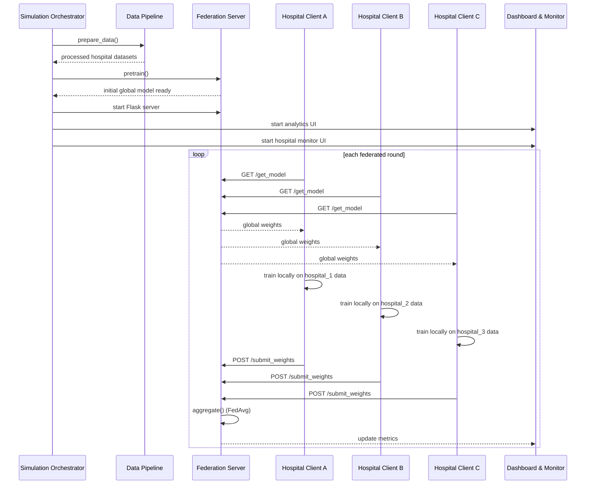
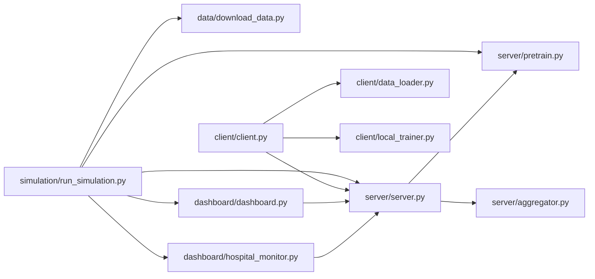

# FedECG Project Workflow

This document describes the complete FedECG workflow from data preparation through federated training, aggregation, and monitoring.

## 1. Overview

FedECG is a federated learning system for ECG arrhythmia detection. The workflow includes:
- centralized orchestration via `simulation/run_simulation.py`
- data download and preprocessing in `data/download_data.py`
- local client training in `client/`
- server aggregation in `server/`
- live monitoring dashboards in `dashboard/`

## 2. High-level Workflow



## 3. Component Architecture



## 4. Detailed Workflow Steps

### 4.1 Data Preparation

- `data/download_data.py` reads raw ECG data from the MIT-BIH dataset.
- It preprocesses ECG signals into fixed-length windows and labels them.
- It creates private hospital partitions in `data/processed/hospital_1`, `hospital_2`, and `hospital_3`.
- It also generates a central validation split in `data/processed/server_val_X.npy` and `server_val_y.npy`.

### 4.2 Pretraining

- `server/pretrain.py` optionally trains the global model on seed data.
- The pretrained model is stored at `checkpoints/global_model_pretrained.pt`.
- `server/server.py` loads this checkpoint on startup.

### 4.3 Server Startup

- `simulation/run_simulation.py` calls `server.create_app()` and starts the Flask server.
- `server/server.py` exposes API endpoints:
  - `GET /get_model`
  - `POST /submit_weights`
  - `POST /aggregate`
  - validation and metrics endpoints
- The server holds the global PyTorch model and metrics history.

### 4.4 Local Client Training

- `client/client.py` implements `FederatedClient`.
- Each client:
  - fetches the current global model weights via `GET /get_model`
  - loads its private data partition with `client/data_loader.py`
  - trains locally using `client/local_trainer.py`
  - submits updated weights and metrics to `/submit_weights`

### 4.5 Aggregation and Evaluation

- `server/aggregator.py` accumulates weight submissions and sample counts.
- The server calls `aggregate()` to perform FedAvg using proportional weighting.
- After aggregation, the server evaluates the updated global model on held-out validation data.
- Metrics are recorded for:
  - global accuracy and loss
  - client losses and accuracies
  - weight divergence
  - best model checkpoint

## 5. Data Flow Diagram

```mermaid
flowchart TB
    subgraph Local Hospital
        H1[Hospital 1 Data]
        H2[Hospital 2 Data]
        H3[Hospital 3 Data]
        C1[Client 1]
        C2[Client 2]
        C3[Client 3]
    end

    subgraph Central Server
        S[Server / Global Model]
        A[Aggregator (FedAvg)]
        V[Validation Data]
        CP[Checkpoints]
    end

    H1 --> C1
    H2 --> C2
    H3 --> C3
    C1 --> S
    C2 --> S
    C3 --> S
    S --> A
    A --> S
    S --> CP
    S --> V
```

## 6. Execution Notes

- The main command to run the full pipeline is:

```bash
python simulation/run_simulation.py
```

- The simulation will:
  - ensure processed data exists
  - optionally pretrain the model
  - launch the server and dashboards
  - run federated rounds continuously

- Dashboards:
  - Analytics UI: `http://127.0.0.1:8050`
  - Hospital Monitor: `http://127.0.0.1:8051`

## 7. Key Files and Roles

- `simulation/run_simulation.py`: orchestration entry point
- `data/download_data.py`: prepare and silo ECG data
- `server/server.py`: central federation server and REST API
- `server/global_model.py`: CNN model definition and serialization
- `server/aggregator.py`: FedAvg aggregation logic
- `client/client.py`: federated client lifecycle
- `dashboard/dashboard.py`: visualization dashboard
- `dashboard/hospital_monitor.py`: real-time ECG monitor

## 8. Recommended Reading

- `README.md`: project overview and goals
- `docs/workflow.md`: this detailed workflow documentation with diagrams
